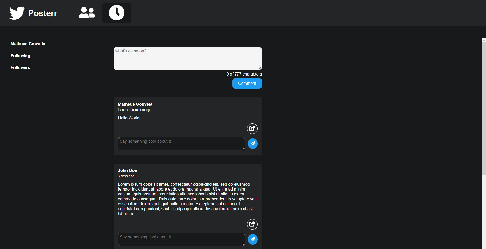
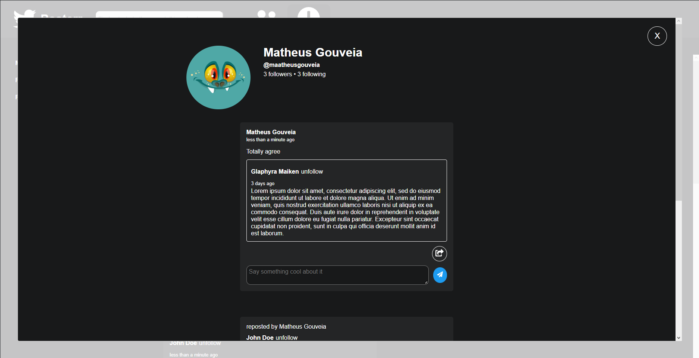

# Posterr

## Installing dependencies

To install the dependencies of this project you may execute the command `yarn` or `npm i`

## Server

To start the server run on your terminal the command `yarn server` or `npm run server` after running the installation command

## Running the project

To run this project on your computer execute the command `yarn start` or `npm start` on your terminal

### Home

### Profile

#API Resources

    http://localhost:3333/users

    http://localhost:3333/posts

    http://localhost:3333/comments

    http://localhost:3333/following

# Planning

# Critique
