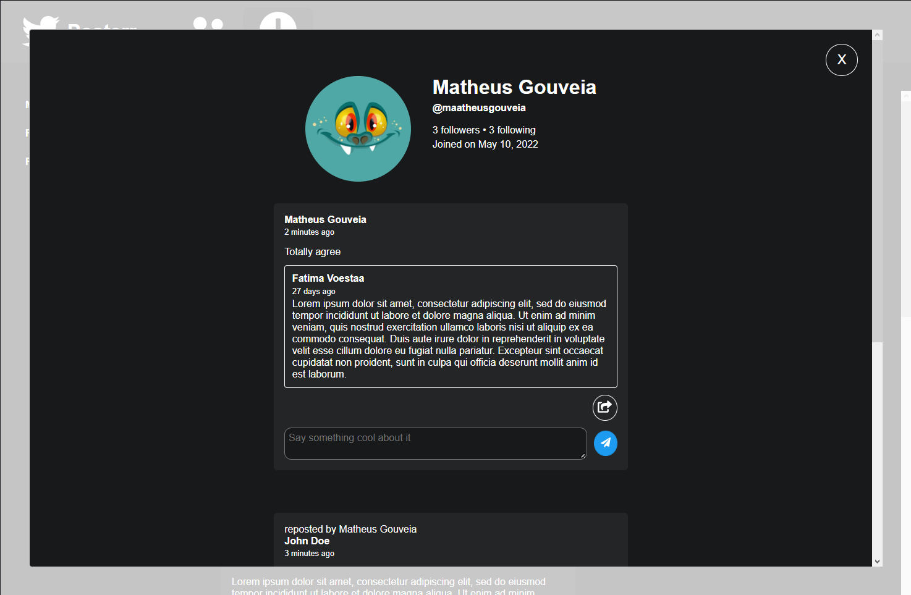

# Posterr

## Installing dependencies

To install the dependencies of this project you may execute the command `yarn` or `npm i`

## Server

To start the server run on your terminal the command `yarn server` or `npm run server` after running the installation command

## Running the project

To run this project on your computer execute the command `yarn start` or `npm start` on your terminal

### Home

### Profile

#API Resources

    http://localhost:3333/users

    http://localhost:3333/posts

    http://localhost:3333/comments

    http://localhost:3333/following

# Debugging with reactotron

    https://github.com/infinitered/reactotron

# Planning

# Critique

    - Add some i18n lib for internationalization and add support to more languages.

    - Add some SSR lib or framework (e.g.: next.js) to improve SEO and avoid page flickering.

    - Material ui could be a good addition, specially the built in Grid components to make it easier to create interfaces. The variety of ready-made components would also make development faster and more consistent

    - Move all redux action types to a types.js file as constants within each module to simplify future maintenance. Whenever some type is needed I could just import the constant from the file and when I need to make some change I will have to change it in just one place.

    - Create loading animations to improve user experience

    - All validations should be received from api to provide an updated feedback for the user about the current state of the database (on post creation for example).

    - Improve cache using redis to have a faster response from the server.

    - In browser notification when some user reposts your content or starts to follow your account.

    - Use typescript for type support and get errors faster as typescript validates code on transpilation. It should make code management easier and improve team productivity.
